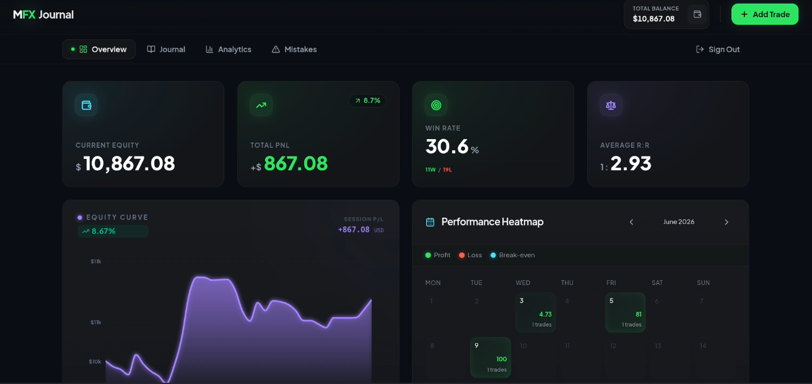
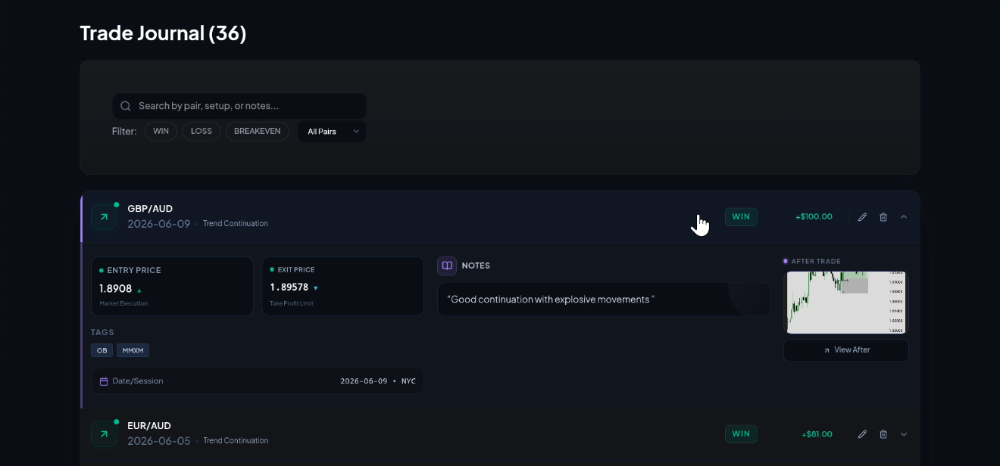
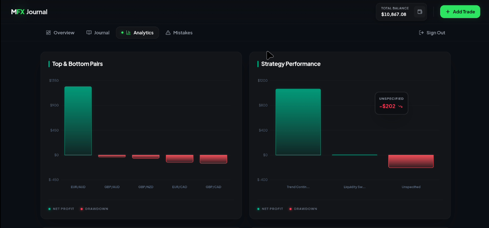
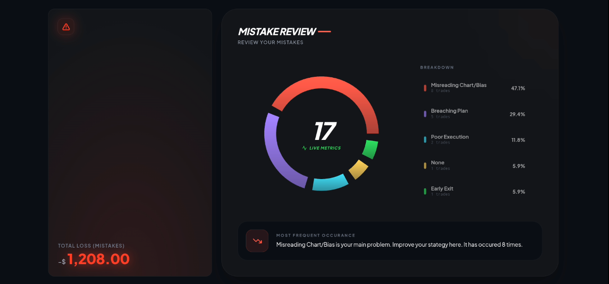

# MUYE FX Trading Journal

A modern Forex Trading Journal and Performance Analytics platform built to help traders track trades, analyze performance, identify mistakes, and improve consistency.

## Live Demo

🌐 https://danmuye-mfx.vercel.app/

---

## Features

### Trade Journal
- Add and manage trades
- Track entry, stop loss, take profit, and outcomes
- Upload trade screenshots
- Record trading sessions and strategies
- Document trade mistakes and lessons learned

### Performance Dashboard
- Account equity tracking
- Win rate analysis
- Risk-to-reward calculations
- Profit and loss statistics
- Trade distribution insights

### Advanced Analytics
- Pair performance analysis
- Session performance tracking
- Day-of-week analysis
- Strategy performance metrics
- Equity curve visualization
- Trading calendar heatmap

### Mistake Tracking
- Log trading mistakes
- Analyze recurring errors
- Measure losses caused by mistakes
- Improve discipline through data-driven review

### Authentication
- Secure user accounts
- Cloud-synced trading data
- Password management
- Personal trading journal storage

---

## Tech Stack

### Frontend
- React.js
- Vite
- Tailwind CSS
- Lucide React

### Charts & Analytics
- Recharts

### Backend & Database
- Firebase Authentication
- Cloud Firestore

### Media Storage
- ImgBB API

### Deployment
- Vercel

---

## Screenshots

### Dashboard


### Journal


### Analytics


### Mistakes


---

## Installation

### Clone Repository

```bash
git clone https://github.com/yourusername/muye-fx-journal.git
```

### Navigate Into Project

```bash
cd muye-fx-journal
```

### Install Dependencies

```bash
npm install
```

### Configure Environment Variables

Create a `.env` file:

```env
VITE_FIREBASE_API_KEY=
VITE_FIREBASE_AUTH_DOMAIN=
VITE_FIREBASE_PROJECT_ID=
VITE_FIREBASE_STORAGE_BUCKET=
VITE_FIREBASE_MESSAGING_SENDER_ID=
VITE_FIREBASE_APP_ID=

VITE_IMGBB_API_KEY=
```

### Start Development Server

```bash
npm run dev
```

---

## Production Build

```bash
npm run build
```

Preview build:

```bash
npm run preview
```

---

## Project Goal

The goal of MUYE FX Trading Journal is to provide traders with a professional platform for:

- Recording trades
- Tracking performance
- Reviewing mistakes
- Developing discipline
- Building consistency
- Improving profitability

---

## About The Developer

### Musa Mahmud Usman (Danmuye)

Founder of Danmuye Ventures

- Computer Scientist
- Forex Trader
- Web Developer
- Founder of MUYE FX
- Founder of MFX Academy

---

## Contact

📧 Email: musamahmud11@gmail.com

---

## License

This project is licensed under the MIT License.

---

### MUYE FX

**Trade. Review. Improve.**
